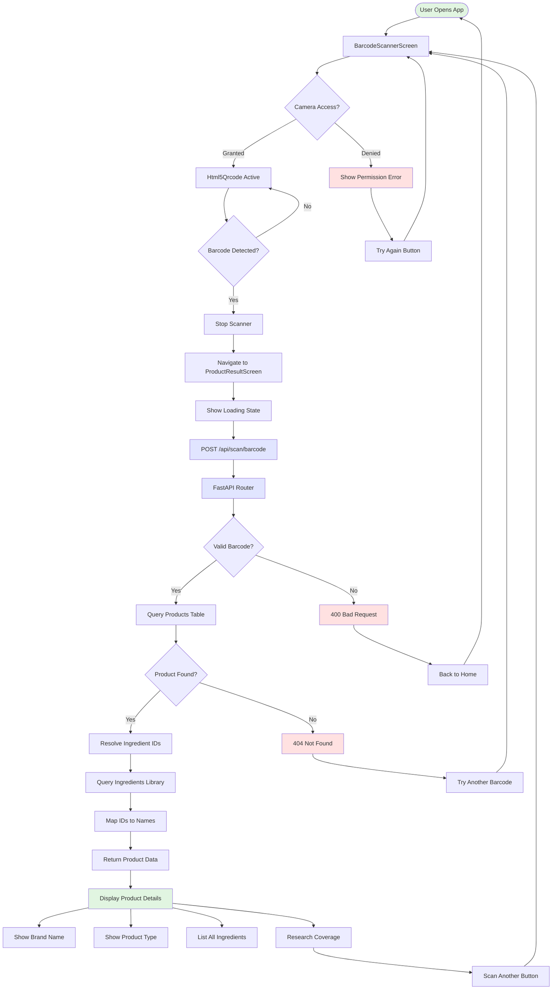
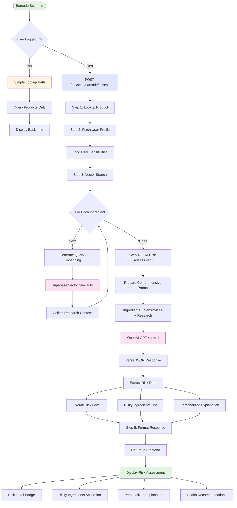
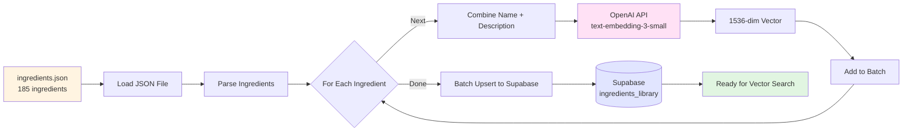
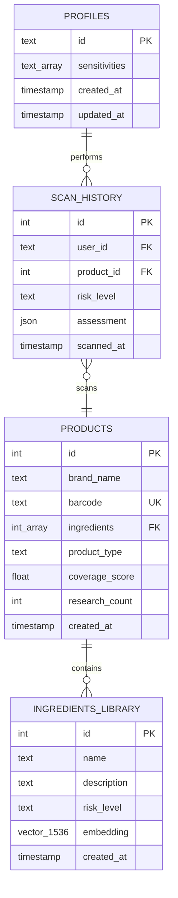
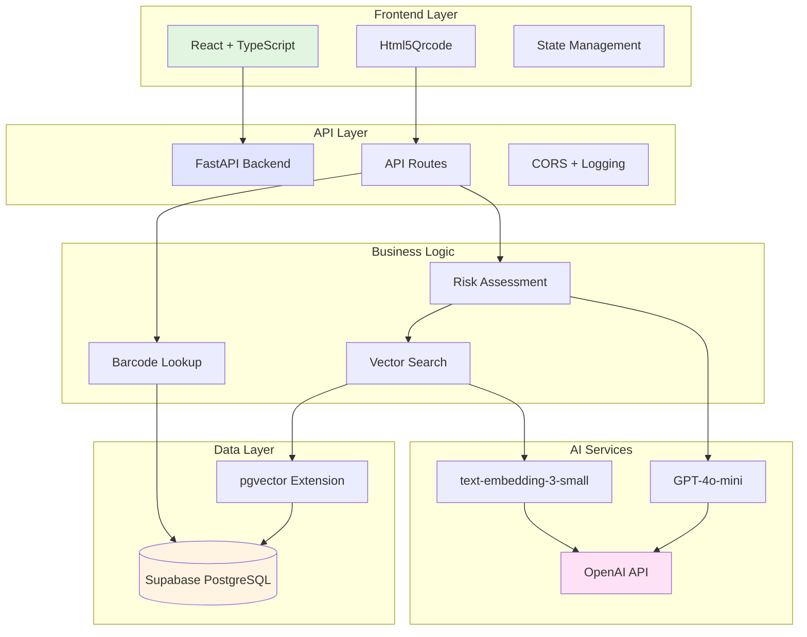
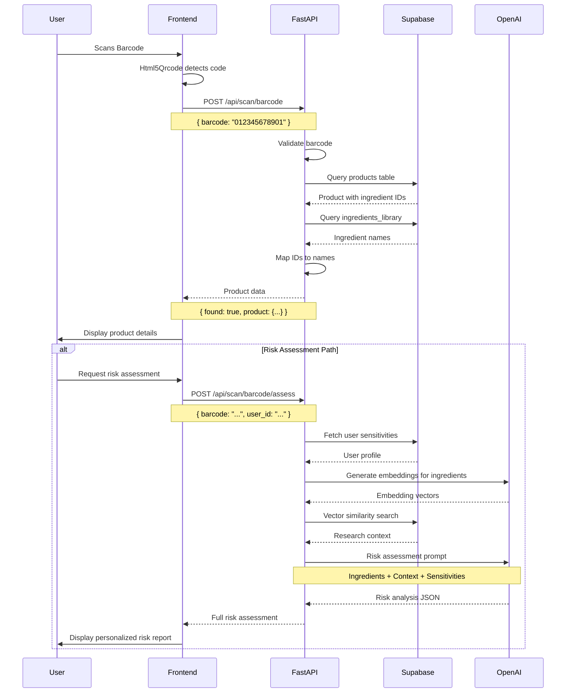
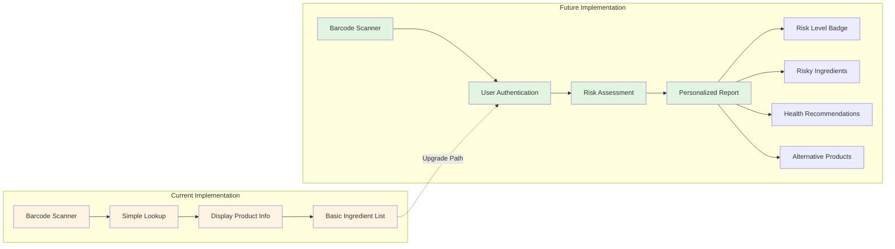

# Visual Barcode Scan Flow Diagram

## Complete End-to-End Flow

## Risk Assessment Flow (Advanced Path)

## Data Ingestion Pipeline

## Database Schema Relationships

## Technology Stack Layers

## Request/Response Flow

## Current vs Future State

---

**Legend:**
- 🟢 Green: Start/Success states
- 🔵 Blue: API/Backend operations
- 🟡 Yellow: Simple path/Basic features
- 🔴 Red: Error states
- 🟣 Purple: AI/ML operations

**Last Updated:** 2026-01-31
