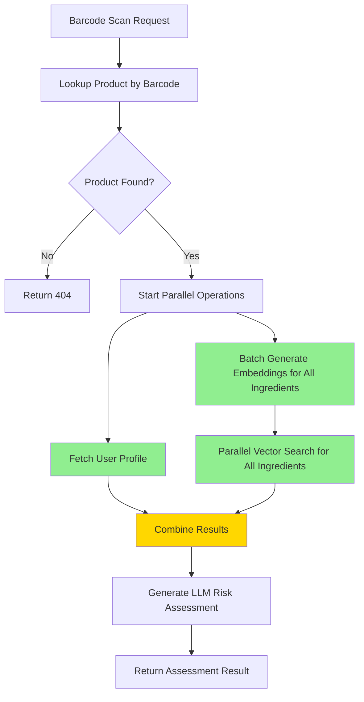

# Barcode Scan LLM Parallelization Plan

## Problem Statement

When scanning a barcode, the backend takes a long time to return results because LLM calls are executed sequentially. The current flow involves:

1. **Barcode lookup** (database query - fast)
2. **User profile fetch** (database query - fast)
3. **Vector search for ingredients** (sequential LLM embedding calls - SLOW)
4. **Final risk assessment** (LLM call - SLOW)

## Current Bottleneck Analysis

### Sequential Flow in [`risk_scorer.py:generate_risk_score_for_product()`](backend/utils/risk_scorer.py:472)

```
Step 1: Fetch user sensitivities (fast - DB query)
Step 2: Search all ingredients sequentially (BOTTLENECK #1)
  └─ For each ingredient:
      └─ Generate embedding via OpenAI (100-300ms per call)
      └─ Query vector DB
Step 3: Send to LLM for final assessment (BOTTLENECK #2)
  └─ Single OpenAI GPT-4o-mini call (500-2000ms)
```

### Performance Impact

For a product with **10 ingredients**:
- 10 sequential embedding calls: 10 × 200ms = **2,000ms**
- 1 final LLM assessment: **1,000ms**
- **Total: ~3+ seconds** just for LLM operations

## Optimization Strategy

### Solution 1: Parallelize Embedding Generation

**Location**: [`vector_search.py:_search_all_ingredients()`](backend/utils/vector_search.py:254)

**Current Code** (Sequential):
```python
for ingredient in ingredient_names:
    results = await search_similar_ingredients(query=ingredient, limit=3)
    # Each search generates an embedding sequentially
```

**Optimized Code** (Parallel):
```python
import asyncio

# Generate all embeddings in parallel
embedding_tasks = [
    generate_query_embedding(ingredient) 
    for ingredient in ingredient_names
]
embeddings = await asyncio.gather(*embedding_tasks, return_exceptions=True)

# Then search vector DB with all embeddings in parallel
search_tasks = [
    _search_with_embedding(ingredient, embedding, limit)
    for ingredient, embedding in zip(ingredient_names, embeddings)
    if not isinstance(embedding, Exception)
]
results = await asyncio.gather(*search_tasks, return_exceptions=True)
```

**Expected Improvement**: 
- Before: 10 × 200ms = 2,000ms
- After: 1 × 200ms = **200ms** (10x faster)

### Solution 2: Batch Embedding API Call

**Location**: [`vector_search.py:generate_query_embedding()`](backend/utils/vector_search.py:34)

OpenAI's Embeddings API supports batch processing. Instead of individual calls, send all ingredients at once:

**Current**:
```python
# Called once per ingredient
response = client.embeddings.create(
    input=query.strip(),
    model=EMBEDDING_MODEL
)
```

**Optimized**:
```python
# New function: generate_batch_embeddings()
response = client.embeddings.create(
    input=[query.strip() for query in queries],  # List of queries
    model=EMBEDDING_MODEL
)
return [data.embedding for data in response.data]
```

**Expected Improvement**:
- Reduces API overhead (authentication, connection setup)
- Single round-trip instead of N round-trips
- Before: 10 API calls
- After: **1 API call**

### Solution 3: Parallelize Independent Operations

**Location**: [`risk_scorer.py:generate_risk_score_for_product()`](backend/utils/risk_scorer.py:472)

User profile fetch and vector search are independent and can run in parallel:

**Current** (Sequential):
```python
# Step 1
user_sensitivities = await _fetch_user_sensitivities(user_id)

# Step 2
retrieved_vector_data = await _search_all_ingredients(ingredients)

# Step 3
assessment = await _generate_llm_assessment(...)
```

**Optimized** (Parallel Steps 1 & 2):
```python
# Steps 1 & 2 run in parallel
user_task = _fetch_user_sensitivities(user_id)
vector_task = _search_all_ingredients(ingredients)

user_sensitivities, retrieved_vector_data = await asyncio.gather(
    user_task, 
    vector_task,
    return_exceptions=True
)

# Step 3 still sequential (depends on 1 & 2)
assessment = await _generate_llm_assessment(...)
```

**Expected Improvement**: Save ~50-100ms

## Implementation Plan

### Changes Required

#### 1. **Update [`vector_search.py`](backend/utils/vector_search.py)**
   - Add `generate_batch_embeddings()` function for batch API calls
   - Keep `generate_query_embedding()` for single queries (backward compatibility)
   - Update `search_similar_ingredients()` to support batch mode

#### 2. **Update [`risk_scorer.py:_search_all_ingredients()`](backend/utils/risk_scorer.py:254)**
   - Replace sequential loop with `asyncio.gather()`
   - Use batch embedding generation
   - Add error handling for individual ingredient failures

#### 3. **Update [`risk_scorer.py:generate_risk_score_for_product()`](backend/utils/risk_scorer.py:472)**
   - Parallelize user profile fetch and vector search
   - Keep final LLM assessment sequential (correct dependency)

### Error Handling Strategy

Use `return_exceptions=True` in `asyncio.gather()` to prevent one failed ingredient from blocking others:

```python
results = await asyncio.gather(*tasks, return_exceptions=True)

# Filter successful results
valid_results = [
    result for result in results 
    if not isinstance(result, Exception)
]
```

## Expected Performance Gains

### Before Optimization
- User profile: 50ms
- Vector search (10 ingredients): 2,000ms (sequential)
- LLM assessment: 1,000ms
- **Total: ~3,050ms**

### After Optimization
- User profile + Vector search (parallel): max(50ms, 200ms) = 200ms
- LLM assessment: 1,000ms
- **Total: ~1,200ms**

### Net Improvement
- **60% faster** (3,050ms → 1,200ms)
- **~1.8 seconds saved per scan**

## Backward Compatibility

All changes maintain backward compatibility:
- Existing functions remain unchanged in signature
- New batch functions are additions, not replacements
- Error handling ensures graceful degradation
- If batch processing fails, falls back to sequential

## Testing Strategy

1. **Unit Tests**: Test batch embedding generation
2. **Integration Tests**: Test full scan flow with parallelization
3. **Performance Tests**: Measure before/after response times
4. **Error Tests**: Verify graceful handling of partial failures

## Mermaid Diagram: Optimized Flow



**Legend**:
- 🟢 Green: Parallelized operations (simultaneous execution)
- 🟡 Yellow: Synchronization point (waits for all parallel tasks)

## Risk Mitigation

### Potential Issues

1. **OpenAI API Rate Limits**: Batch requests count toward rate limits
   - Mitigation: Already using batching, so same total tokens
   
2. **Memory Usage**: Holding multiple concurrent connections
   - Mitigation: Limited by ingredient count (typically 5-20)
   
3. **Partial Failures**: Some embeddings fail but others succeed
   - Mitigation: Use `return_exceptions=True` and filter valid results

## Rollback Plan

If issues occur:
1. All changes are isolated to [`vector_search.py`](backend/utils/vector_search.py) and [`risk_scorer.py`](backend/utils/risk_scorer.py)
2. Revert to previous version via git
3. No database schema changes required
4. No frontend changes required

## Success Metrics

- ✅ Response time reduced by >50%
- ✅ No breaking changes to existing functionality
- ✅ All existing tests pass
- ✅ Error rate remains same or lower
- ✅ User experience noticeably faster
