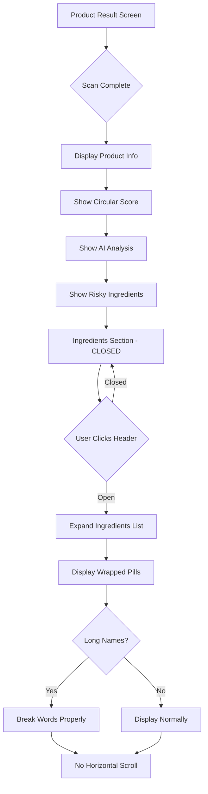

# Horizontal Scroll Fix - Product Result Screen

## Problem Analysis

After scanning a product, users can scroll horizontally (left/right) on the screen, which should not be possible. The screen should only allow vertical scrolling.

### Root Cause

The issue is located in [`ProductResultScreen.tsx`](../frontend/src/components/ProductResultScreen.tsx:531-552) in the **All Ingredients** section (lines 531-552).

**Current Implementation:**
```tsx
<div className="flex flex-wrap gap-2">
  {basicProduct.ingredients.map((ingredient, index) => (
    <span className="px-3 py-1.5 rounded-full ...">
      {ingredient}
    </span>
  ))}
</div>
```

**Problems:**
1. The ingredients use `flex-wrap` which causes ingredient pills to wrap, but long ingredient names can expand horizontally beyond the container width
2. The container has no `overflow-x: hidden` constraint
3. Individual ingredient names don't have word-break properties, so long names push the width
4. The main wrapper at line 322 has `w-[393px]` but no explicit `overflow-x: hidden`

## Solution Architecture

### Phase 1: Container Constraints
Fix the main container to prevent any horizontal overflow.

**Changes to [`ProductResultScreen.tsx`](../frontend/src/components/ProductResultScreen.tsx:322):**
- Add `overflow-x-hidden` to the main container (line 322)
- Ensure the scrollable content area (line 359) also has `overflow-x-hidden`

### Phase 2: Collapsible Ingredients Section
Replace the always-visible ingredients list with a collapsible/accordion component that is **closed by default**.

**Implementation Strategy:**

1. **Import Accordion Component**
   - Use existing [`Accordion`](../frontend/src/components/ui/accordion.tsx) components from `@radix-ui/react-accordion`
   - Components available: `Accordion`, `AccordionItem`, `AccordionTrigger`, `AccordionContent`

2. **Replace Ingredients Section (lines 531-552)**
   ```tsx
   <Accordion type="single" collapsible defaultValue="">
     <AccordionItem value="ingredients">
       <AccordionTrigger>
         <h3>Ingredients ({basicProduct.ingredients.length})</h3>
       </AccordionTrigger>
       <AccordionContent>
         <div className="flex flex-wrap gap-2">
           {/* ingredient pills */}
         </div>
       </AccordionContent>
     </AccordionItem>
   </Accordion>
   ```

3. **Key Features:**
   - `defaultValue=""` ensures accordion starts closed
   - `type="single"` allows only one section open at a time
   - `collapsible` allows toggling open/closed
   - ChevronDown icon automatically rotates on open/close

### Phase 3: Ingredient Pill Constraints
Ensure individual ingredient pills don't cause overflow.

**CSS Improvements:**
- Add `max-w-full` to ingredient spans
- Add `break-words` or `break-all` for long ingredient names
- Ensure `word-wrap: break-word` is applied

### Phase 4: Testing Checklist
- ✓ No horizontal scrolling on product result screen
- ✓ Vertical scrolling works smoothly
- ✓ Ingredients section is closed by default
- ✓ Clicking header opens/closes ingredients
- ✓ Long ingredient names wrap properly
- ✓ Chevron icon rotates when opening/closing
- ✓ Works on different screen sizes

## Implementation Details

### File Changes Required

#### [`ProductResultScreen.tsx`](../frontend/src/components/ProductResultScreen.tsx)

**Import Section (line 4):**
```tsx
import { ArrowLeft, CheckCircle, AlertTriangle, XCircle, Loader2, Shield, ShieldCheck, ShieldX, Sparkles, ChevronDown } from "lucide-react";
```

Add after existing imports (around line 6):
```tsx
import { Collapsible, CollapsibleTrigger, CollapsibleContent } from "../components/ui/collapsible";
```

**Main Container (line 322):**
```tsx
<div className="bg-black relative w-[393px] h-[852px] overflow-hidden overflow-x-hidden">
```

**Content Area (line 359):**
```tsx
<div className="absolute top-[140px] left-[24px] right-[24px] bottom-[100px] overflow-y-auto overflow-x-hidden z-20">
```

**Ingredients Section (lines 531-552) - COMPLETE REPLACEMENT:**
```tsx
{basicProduct.ingredients && basicProduct.ingredients.length > 0 && (
  <div className="bg-[#5a3d6b]/50 border border-[#a380a8]/30 rounded-[16px] mb-4">
    <Collapsible defaultOpen={false}>
      <CollapsibleTrigger className="w-full p-5 flex items-center justify-between hover:bg-[#5a3d6b]/70 transition-colors rounded-[16px]">
        <h3 className="font-['Konkhmer_Sleokchher:Regular',sans-serif] text-[16px] text-white tracking-[-0.7px]">
          Ingredients ({basicProduct.ingredients.length})
        </h3>
        <ChevronDown className="h-5 w-5 text-white transition-transform duration-200 ui-expanded:rotate-180" />
      </CollapsibleTrigger>
      <CollapsibleContent>
        <div className="px-5 pb-5">
          <div className="flex flex-wrap gap-2">
            {basicProduct.ingredients.map((ingredient, index) => {
              const isRisky = assessmentData?.risky_ingredients?.some(r => r.name.toLowerCase() === ingredient.toLowerCase());
              return (
                <span 
                  key={index} 
                  className={`px-3 py-1.5 rounded-full font-['Konkhmer_Sleokchher:Regular',sans-serif] text-[11px] tracking-[-0.5px] break-words max-w-full ${
                    isRisky ? "bg-red-500/20 text-red-400 border border-red-500/30" : "bg-white/10 text-white"
                  }`}
                  style={{ wordWrap: 'break-word', overflowWrap: 'break-word' }}
                >
                  {ingredient}
                </span>
              );
            })}
          </div>
        </div>
      </CollapsibleContent>
    </Collapsible>
  </div>
)}
```

### CSS Enhancements (if needed)

Add to [`ProductResultScreen.css`](../frontend/src/components/ProductResultScreen.css):
```css
/* Prevent horizontal overflow */
.overflow-x-hidden {
  overflow-x: hidden !important;
}

/* Ensure ingredient pills break properly */
.ingredient-pill {
  word-break: break-word;
  overflow-wrap: break-word;
  max-width: 100%;
}
```

## Visual Flow Diagram



## Benefits

1. **Improved UX**: No confusing horizontal scrolling
2. **Cleaner Interface**: Ingredients hidden by default reduces visual clutter
3. **Performance**: Less DOM rendered initially
4. **Accessibility**: Proper ARIA attributes from Radix UI
5. **Mobile-Friendly**: Better use of limited screen space
6. **Progressive Disclosure**: Users can expand when interested

## Edge Cases Handled

1. **Very long ingredient names**: `break-words` ensures they wrap
2. **Many ingredients (100+)**: Accordion handles gracefully with internal scrolling
3. **No ingredients**: Section won't render at all
4. **Risky ingredients**: Still highlighted in red when accordion is open
5. **Assessment loading**: Works independently of assessment state

## Next Steps

Once this plan is approved:
1. Switch to **Code mode** to implement the changes
2. Test the implementation in the browser
3. Verify no horizontal scrolling exists
4. Confirm accordion opens/closes smoothly
5. Check that ingredient pills wrap properly

## Related Files

- [`frontend/src/components/ProductResultScreen.tsx`](../frontend/src/components/ProductResultScreen.tsx) - Main component to modify
- [`frontend/src/components/ui/collapsible.tsx`](../frontend/src/components/ui/collapsible.tsx) - Collapsible component to use
- [`frontend/src/components/ui/accordion.tsx`](../frontend/src/components/ui/accordion.tsx) - Alternative accordion option
- [`frontend/src/components/ProductResultScreen.css`](../frontend/src/components/ProductResultScreen.css) - Styling file
