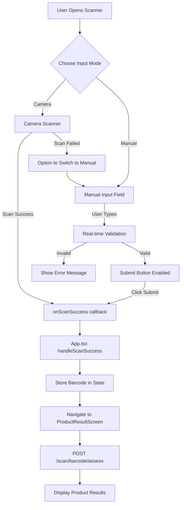

# Manual Barcode Lookup Feature Plan

## Overview
Add optional manual barcode number lookup as a backup alternative to camera-based barcode scanning. This provides users with a reliable fallback when camera scanning fails or is unavailable.

## Current Architecture Analysis

### Existing Barcode Scanning Flow
1. User navigates to [`BarcodeScannerScreen`](../frontend/src/components/BarcodeScannerScreen.tsx:1)
2. Camera scanner initializes using `html5-qrcode` library
3. On successful scan, `onScanSuccess(barcode)` callback is triggered
4. [`App.tsx`](../frontend/src/App.tsx:32) receives barcode via `handleScanSuccess`
5. Barcode is stored in state and user navigates to [`ProductResultScreen`](../frontend/src/components/ProductResultScreen.tsx:1)
6. Backend API endpoint [`/scan/barcode/assess`](../backend/routers/scan.py:206) processes the barcode

### Backend API Endpoints (No Changes Needed)
- **`POST /scan/barcode`** - Simple barcode lookup (line 130 in [`scan.py`](../backend/routers/scan.py:130))
- **`POST /scan/barcode/assess`** - Full risk assessment (line 206 in [`scan.py`](../backend/routers/scan.py:206))
- Both accept [`BarcodeLookupRequest`](../backend/models/schemas.py:193) with `barcode` string
- Backend already validates and handles barcode strings via [`lookup_product_by_barcode`](../backend/utils/barcode_lookup.py:18)

### Supported Barcode Formats
Currently configured in [`BarcodeScannerScreen`](../frontend/src/components/BarcodeScannerScreen.tsx:26):
- UPC-A (12 digits) - Standard US barcodes
- UPC-E (6-8 digits) - Short US barcodes
- EAN-13 (13 digits) - International barcodes
- EAN-8 (8 digits) - Short international barcodes
- CODE-128 (variable) - Shipping/logistics
- CODE-39 (variable) - Alternate format

## Proposed Solution

### UI/UX Design

#### Option 1: Tab-Based Toggle (Recommended)
```
┌─────────────────────────────────────┐
│  [← Back]                           │
├─────────────────────────────────────┤
│  [📷 Scan] [⌨️ Enter Manually]     │  ← Toggle tabs
├─────────────────────────────────────┤
│                                     │
│  Active Content Area:               │
│  - Camera view OR                   │
│  - Manual input field               │
│                                     │
└─────────────────────────────────────┘
```

**Advantages:**
- Clear separation of modes
- Familiar UX pattern
- Easy to discover manual entry option
- Maintains current camera-first workflow

#### Option 2: Button Below Camera View
```
┌─────────────────────────────────────┐
│  [← Back]                           │
├─────────────────────────────────────┤
│                                     │
│     Camera Scanner View             │
│                                     │
├─────────────────────────────────────┤
│  [Can't scan? Enter manually]      │  ← Opens input modal
└─────────────────────────────────────┘
```

**Advantages:**
- Minimal UI changes
- Camera remains primary method
- Manual entry is secondary/backup

### Implementation Strategy

#### Frontend Changes

##### 1. Update [`BarcodeScannerScreen.tsx`](../frontend/src/components/BarcodeScannerScreen.tsx:1)

**New State Variables:**
```typescript
const [inputMode, setInputMode] = useState<'camera' | 'manual'>('camera');
const [manualBarcode, setManualBarcode] = useState('');
const [validationError, setValidationError] = useState('');
```

**Barcode Validation Function:**
```typescript
const validateBarcode = (barcode: string): { valid: boolean; error?: string } => {
  const trimmed = barcode.trim();
  
  // Check if empty
  if (!trimmed) {
    return { valid: false, error: 'Barcode cannot be empty' };
  }
  
  // Check if contains only digits (most common barcode formats)
  if (!/^\d+$/.test(trimmed)) {
    return { valid: false, error: 'Barcode should contain only numbers' };
  }
  
  // Check common barcode lengths
  const validLengths = [6, 8, 12, 13, 14]; // UPC-E, EAN-8, UPC-A, EAN-13, ITF-14
  if (!validLengths.includes(trimmed.length)) {
    return { 
      valid: false, 
      error: `Invalid length. Expected 6, 8, 12, 13, or 14 digits, got ${trimmed.length}` 
    };
  }
  
  return { valid: true };
};
```

**Manual Submit Handler:**
```typescript
const handleManualSubmit = () => {
  const validation = validateBarcode(manualBarcode);
  
  if (!validation.valid) {
    setValidationError(validation.error || 'Invalid barcode');
    return;
  }
  
  // Clean up and submit
  const cleanBarcode = manualBarcode.trim();
  stopScanner(); // Stop camera if running
  onScanSuccess(cleanBarcode);
};
```

**UI Components:**

*Tab Toggle:*
```tsx
<div className="flex gap-2 mb-4">
  <button
    onClick={() => setInputMode('camera')}
    className={`flex-1 py-2 rounded ${
      inputMode === 'camera' 
        ? 'bg-[#a380a8] text-white' 
        : 'bg-white/10 text-white/70'
    }`}
  >
    📷 Scan
  </button>
  <button
    onClick={() => setInputMode('manual')}
    className={`flex-1 py-2 rounded ${
      inputMode === 'manual' 
        ? 'bg-[#a380a8] text-white' 
        : 'bg-white/10 text-white/70'
    }`}
  >
    ⌨️ Enter Manually
  </button>
</div>
```

*Manual Input Form:*
```tsx
{inputMode === 'manual' && (
  <div className="px-8">
    <div className="bg-white/10 rounded-[20px] p-6">
      <label className="block mb-2 text-white text-sm">
        Enter Barcode Number
      </label>
      <input
        type="text"
        inputMode="numeric"
        pattern="[0-9]*"
        value={manualBarcode}
        onChange={(e) => {
          setManualBarcode(e.target.value);
          setValidationError('');
        }}
        placeholder="e.g., 037000561538"
        className="w-full px-4 py-3 rounded-[10px] bg-white text-black"
      />
      {validationError && (
        <p className="text-red-400 text-xs mt-2">{validationError}</p>
      )}
      <button
        onClick={handleManualSubmit}
        className="w-full mt-4 bg-[#a380a8] py-3 rounded-[10px] text-white"
      >
        Look Up Product
      </button>
    </div>
  </div>
)}
```

##### 2. Enhanced Error Handling

Add specific error messages for different validation failures:
- Empty barcode
- Invalid characters
- Wrong length
- Backend lookup failure (product not found)

##### 3. User Feedback

**Loading State:**
```tsx
const [isLookingUp, setIsLookingUp] = useState(false);

// During manual submission
setIsLookingUp(true);
onScanSuccess(cleanBarcode);
```

**Visual Feedback:**
- Show loading spinner during lookup
- Success animation on valid barcode
- Error shake animation on invalid input

#### Backend Changes

**No backend changes required!** 

The existing API endpoints already accept barcode strings and handle validation:
- [`/scan/barcode`](../backend/routers/scan.py:130) - Basic lookup
- [`/scan/barcode/assess`](../backend/routers/scan.py:206) - Full assessment

The [`lookup_product_by_barcode`](../backend/utils/barcode_lookup.py:18) function validates barcode strings and queries the database.

### Design System Consistency

**Colors (from existing components):**
- Background: `#0e0808`
- Primary button: `#a380a8`
- Hover state: `#8d6d91`
- Text: `white`
- Secondary text: `white/70`

**Typography:**
- Font: `Konkhmer_Sleokchher:Regular`
- Tracking: `-0.65px` (small text), `-2px` (headers)

**Border Radius:**
- Buttons: `10px`
- Input fields: `10px`
- Containers: `20px`

### Accessibility Considerations

1. **Keyboard Navigation**
   - Tab order: Toggle → Input → Submit
   - Enter key submits form
   - Escape key cancels/goes back

2. **Mobile Input**
   - Use `inputMode="numeric"` for mobile number keyboards
   - Use `pattern="[0-9]*"` for iOS numeric keyboard

3. **Screen Readers**
   - Add `aria-label` attributes
   - Add `role="tabpanel"` for toggle sections
   - Announce validation errors

4. **Visual Feedback**
   - Clear focus states
   - High contrast error messages
   - Loading indicators

### Testing Strategy

#### Unit Tests
- Validate barcode format validation function
- Test various barcode lengths (6, 8, 12, 13, 14 digits)
- Test invalid inputs (letters, special characters, wrong length)
- Test empty input handling

#### Integration Tests
1. **Manual Entry Flow:**
   - Enter valid barcode → Submit → Navigate to results
   - Enter invalid barcode → See error message
   - Toggle between camera and manual modes

2. **Camera to Manual Fallback:**
   - Camera fails → Switch to manual → Submit → Success

3. **Backend Integration:**
   - Test with known barcodes from test database
   - Test with invalid/unknown barcodes
   - Verify error handling

#### Test Barcodes
From [`seed_test_barcodes.sql`](../backend/database/seed_test_barcodes.sql:1):
- `037000561538` - Always pads (known product)
- Use these for testing manual entry

### Implementation Phases

#### Phase 1: Core Functionality
- Add toggle mechanism between camera/manual modes
- Implement manual input field
- Add basic barcode validation
- Connect to existing `onScanSuccess` callback

#### Phase 2: Enhanced Validation & UX
- Implement comprehensive barcode format validation
- Add real-time input validation feedback
- Add loading states and animations
- Improve error messages

#### Phase 3: Polish & Testing
- Refine styling to match design system
- Add accessibility features
- Comprehensive testing with various barcodes
- Performance optimization

### Edge Cases to Handle

1. **User switches modes mid-scan**
   - Stop camera when switching to manual
   - Clear manual input when switching to camera

2. **Barcode with leading zeros**
   - Preserve leading zeros (important for UPC codes)
   - Use string type, not number type

3. **Very long barcodes**
   - Add max length validation
   - Prevent overflow in UI

4. **Camera permission denied**
   - Automatically suggest manual entry
   - Show helpful message

5. **Network failure during lookup**
   - Show retry option
   - Allow user to re-enter or scan again

### Success Metrics

- **Discoverability:** Users can easily find manual entry option
- **Usability:** Manual entry takes < 10 seconds
- **Accuracy:** Validation prevents invalid submissions
- **Reliability:** Works even when camera fails
- **Accessibility:** Keyboard navigation and screen reader compatible

## Architecture Diagram



## Flow Comparison

### Current Flow (Camera Only)
1. Open scanner → Camera starts
2. Point at barcode
3. Auto-detect and scan
4. Navigate to results

### New Flow (With Manual Option)
1. Open scanner → Camera starts (default)
2. **Option A:** Point at barcode → Auto-detect → Results
3. **Option B:** Toggle to manual → Type barcode → Submit → Results

## File Changes Summary

### Files to Modify
1. [`frontend/src/components/BarcodeScannerScreen.tsx`](../frontend/src/components/BarcodeScannerScreen.tsx:1)
   - Add manual input mode toggle
   - Add input field and validation
   - Add barcode format validation logic
   - Update UI layout for dual modes

### Files to Create
None - all changes in existing component

### Files NOT Changed
- [`backend/routers/scan.py`](../backend/routers/scan.py:1) - API already supports string barcodes
- [`backend/utils/barcode_lookup.py`](../backend/utils/barcode_lookup.py:1) - Already validates input
- [`backend/models/schemas.py`](../backend/models/schemas.py:1) - Schema already correct
- [`frontend/src/App.tsx`](../frontend/src/App.tsx:1) - Flow remains the same
- [`frontend/src/components/ProductResultScreen.tsx`](../frontend/src/components/ProductResultScreen.tsx:1) - No changes needed

## Risk Assessment

### Low Risk
- ✅ Backend already supports manual barcode input
- ✅ Minimal UI changes required
- ✅ Non-breaking change (additive feature)
- ✅ Can be implemented incrementally

### Potential Issues
- ⚠️ Users might enter invalid barcodes → Mitigated by validation
- ⚠️ Manual entry slower than scanning → Acceptable for backup method
- ⚠️ UI complexity increases slightly → Mitigated by clear toggle design

## Conclusion

This feature provides essential backup functionality for barcode scanning with minimal risk and development effort. The backend already supports this use case, so implementation is primarily a frontend UI/UX enhancement.

**Recommended Approach:** Start with Option 1 (Tab-based toggle) for better discoverability and user experience.
