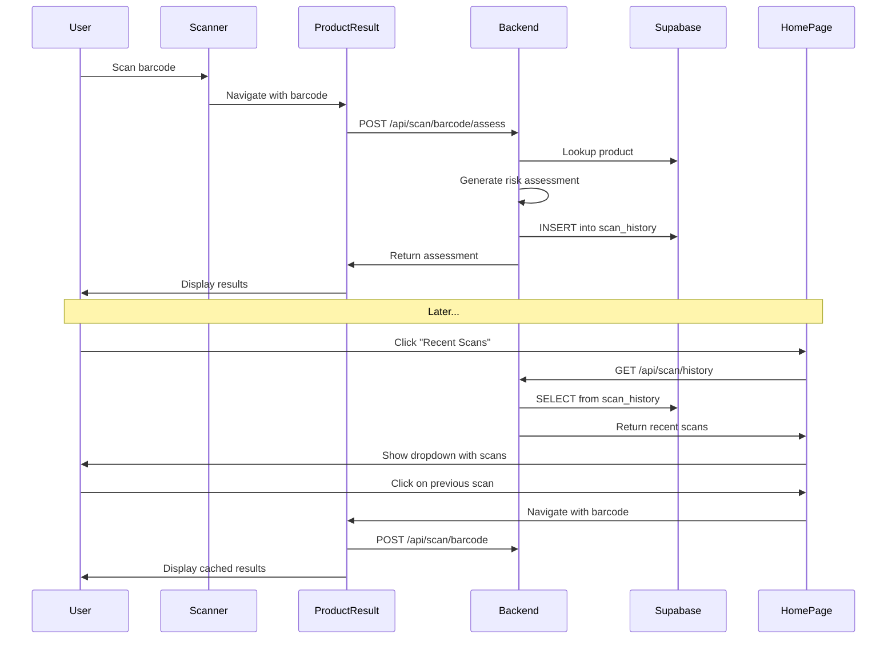

# Recent Scans Feature Implementation Plan

## Overview
Implement a "Recent Scans" feature that saves user scan history to Supabase and displays it in a clickable dropdown on the [`HomePageScreen`](../frontend/src/components/HomePageScreen.tsx:67).

---

## Current State Analysis

### Scan Flow (Lines 64-137 in [`ProductResultScreen.tsx`](../frontend/src/components/ProductResultScreen.tsx:64))
1. User scans barcode in [`BarcodeScannerScreen`](../frontend/src/components/BarcodeScannerScreen.tsx)
2. Frontend calls `/api/scan/barcode` (basic lookup)
3. Frontend calls `/api/scan/barcode/assess` (full assessment with risk scoring)
4. Results displayed in [`ProductResultScreen`](../frontend/src/components/ProductResultScreen.tsx)

### Current Backend Endpoints (in [`scan.py`](../backend/routers/scan.py))
- **Line 22-86**: `POST /api/scan/barcode` - Basic product lookup
- **Line 98-204**: `POST /api/scan/barcode/assess` - Full assessment with risk scoring

### Problem
**Scan history is NOT being saved** - Assessment response (line 183-195) includes `scan_id` but doesn't persist to database.

---

## Solution Architecture

### Database Layer

#### Create `scan_history` Table in Supabase

```sql
-- File: backend/database/create_scan_history_table.sql

CREATE TABLE IF NOT EXISTS scan_history (
    id BIGSERIAL PRIMARY KEY,
    scan_id UUID NOT NULL UNIQUE,
    user_id TEXT NOT NULL REFERENCES profiles(id) ON DELETE CASCADE,
    product_id INTEGER NOT NULL REFERENCES products(id) ON DELETE CASCADE,
    barcode TEXT NOT NULL,
    risk_level TEXT NOT NULL,  -- "Low Risk", "Caution", "High Risk"
    risk_score INTEGER,  -- 0-100 (optional from assessment)
    risky_ingredients JSONB,  -- Array of risky ingredient objects
    explanation TEXT,  -- LLM-generated explanation
    scanned_at TIMESTAMP WITH TIME ZONE DEFAULT NOW(),
    
    -- Indexes for fast queries
    CONSTRAINT valid_risk_level CHECK (risk_level IN ('Low Risk', 'Caution', 'High Risk'))
);

-- Index for user's recent scans
CREATE INDEX idx_scan_history_user_id ON scan_history(user_id, scanned_at DESC);

-- Index for scan_id lookups
CREATE INDEX idx_scan_history_scan_id ON scan_history(scan_id);

-- Index for barcode lookups
CREATE INDEX idx_scan_history_barcode ON scan_history(barcode);

-- Enable Row Level Security
ALTER TABLE scan_history ENABLE ROW LEVEL SECURITY;

-- Policy: Users can only see their own scans
CREATE POLICY "Users can view their own scan history"
    ON scan_history FOR SELECT
    USING (auth.uid()::text = user_id);

-- Policy: Users can insert their own scans
CREATE POLICY "Users can insert their own scans"
    ON scan_history FOR INSERT
    WITH CHECK (auth.uid()::text = user_id);
```

**Table Schema Summary**:
| Column | Type | Description |
|--------|------|-------------|
| `id` | BIGSERIAL | Primary key |
| `scan_id` | UUID | Unique identifier from assessment |
| `user_id` | TEXT | FK to profiles(id) |
| `product_id` | INTEGER | FK to products(id) |
| `barcode` | TEXT | Product barcode scanned |
| `risk_level` | TEXT | Low Risk/Caution/High Risk |
| `risk_score` | INTEGER | 0-100 safety score (optional) |
| `risky_ingredients` | JSONB | Array of risky ingredient details |
| `explanation` | TEXT | LLM-generated explanation |
| `scanned_at` | TIMESTAMP | When scan occurred |

---

### Backend Layer

#### Step 1: Update [`scan.py`](../backend/routers/scan.py) - Save Scan History

**Location**: After line 191 in [`scan.py`](../backend/routers/scan.py:191)

Add function to save scan history:

```python
from utils.supabase_client import get_supabase_client

async def save_scan_to_history(
    scan_id: str,
    user_id: str,
    product: BarcodeProduct,
    risk_level: str,
    risk_score: Optional[int],
    risky_ingredients: list,
    explanation: str
) -> bool:
    """
    Save scan to scan_history table in Supabase
    
    Returns:
        bool: True if successful, False otherwise
    """
    try:
        supabase = get_supabase_client()
        
        data = {
            "scan_id": scan_id,
            "user_id": user_id,
            "product_id": product.id,
            "barcode": product.barcode,
            "risk_level": risk_level,
            "risk_score": risk_score,
            "risky_ingredients": risky_ingredients,
            "explanation": explanation
        }
        
        result = supabase.table("scan_history").insert(data).execute()
        
        if result.data:
            logger.info(f"Scan history saved: {scan_id}")
            return True
        else:
            logger.warning(f"Failed to save scan history: {scan_id}")
            return False
            
    except Exception as e:
        logger.error(f"Error saving scan history: {e}", exc_info=True)
        return False
```

**Update `/scan/barcode/assess` endpoint** (line 193):

```python
# After line 191, before return response
logger.info(f"Barcode assessment completed. Risk Level: {response['overall_risk_level']}")

# NEW: Save scan to history (non-blocking)
try:
    await save_scan_to_history(
        scan_id=scan_id,
        user_id=user_id,
        product=product,
        risk_level=response['overall_risk_level'],
        risk_score=assessment.get("risk_score"),
        risky_ingredients=response['risky_ingredients'],
        explanation=response['explanation']
    )
except Exception as e:
    # Non-blocking error - don't fail the scan if history save fails
    logger.warning(f"Could not save scan history: {e}")

return response
```

#### Step 2: Create GET Recent Scans Endpoint

**Add new endpoint in [`scan.py`](../backend/routers/scan.py) after line 216**:

```python
@router.get("/scan/history", tags=["Scan"])
async def get_scan_history(
    user_id: str = Query(..., description="User ID to fetch scan history for"),
    limit: int = Query(10, ge=1, le=50, description="Number of recent scans to return")
) -> dict:
    """
    Get user's recent scan history
    
    Args:
        user_id: User ID
        limit: Number of recent scans (default 10, max 50)
        
    Returns:
        JSON response with:
        - scans: List of recent scans with product details
        - count: Total number of scans returned
        
    Raises:
        HTTPException 400: Invalid user_id
        HTTPException 500: Database error
    """
    try:
        if not user_id or not user_id.strip():
            raise HTTPException(
                status_code=status.HTTP_400_BAD_REQUEST,
                detail="user_id is required"
            )
        
        supabase = get_supabase_client()
        
        # Query scan_history joined with products
        result = supabase.table("scan_history") \
            .select("""
                id,
                scan_id,
                barcode,
                risk_level,
                risk_score,
                scanned_at,
                products:product_id (
                    id,
                    brand_name,
                    product_type
                )
            """) \
            .eq("user_id", user_id) \
            .order("scanned_at", desc=True) \
            .limit(limit) \
            .execute()
        
        if not result.data:
            return {
                "scans": [],
                "count": 0
            }
        
        # Format response
        scans = []
        for scan in result.data:
            product_data = scan.get("products")
            scans.append({
                "scan_id": scan["scan_id"],
                "barcode": scan["barcode"],
                "brand_name": product_data.get("brand_name") if product_data else "Unknown",
                "product_type": product_data.get("product_type") if product_data else "general",
                "risk_level": scan["risk_level"],
                "risk_score": scan.get("risk_score"),
                "scanned_at": scan["scanned_at"]
            })
        
        logger.info(f"Retrieved {len(scans)} scan history records for user {user_id}")
        
        return {
            "scans": scans,
            "count": len(scans)
        }
    
    except HTTPException:
        raise
    except Exception as e:
        logger.error(f"Error fetching scan history: {e}", exc_info=True)
        raise HTTPException(
            status_code=status.HTTP_500_INTERNAL_SERVER_ERROR,
            detail=f"Failed to fetch scan history: {str(e)}"
        )
```

---

### Frontend Layer

#### Step 1: Create RecentScansDropdown Component

**New file**: `frontend/src/components/RecentScansDropdown.tsx`

```typescript
import { useState, useEffect } from "react";
import { ChevronDown, ChevronUp, Clock, AlertTriangle, CheckCircle, XCircle } from "lucide-react";
import { supabase } from "../lib/supabase";

interface ScanHistoryItem {
  scan_id: string;
  barcode: string;
  brand_name: string;
  product_type: string;
  risk_level: string;
  risk_score?: number;
  scanned_at: string;
}

interface RecentScansDropdownProps {
  onScanClick: (barcode: string) => void;
}

export default function RecentScansDropdown({ onScanClick }: RecentScansDropdownProps) {
  const [isOpen, setIsOpen] = useState(false);
  const [scans, setScans] = useState<ScanHistoryItem[]>([]);
  const [loading, setLoading] = useState(false);
  const [error, setError] = useState<string | null>(null);

  useEffect(() => {
    if (isOpen) {
      fetchRecentScans();
    }
  }, [isOpen]);

  const fetchRecentScans = async () => {
    try {
      setLoading(true);
      setError(null);

      // Get current user
      const { data: { user } } = await supabase.auth.getUser();
      
      if (!user) {
        setError("Please log in to view scan history");
        return;
      }

      // Fetch recent scans from backend
      const response = await fetch(
        `${import.meta.env.VITE_API_URL}/api/scan/history?user_id=${user.id}&limit=5`,
        {
          method: "GET",
          headers: {
            "Content-Type": "application/json",
          },
        }
      );

      if (!response.ok) {
        throw new Error("Failed to fetch scan history");
      }

      const data = await response.json();
      setScans(data.scans || []);
    } catch (err) {
      console.error("Error fetching recent scans:", err);
      setError("Could not load scan history");
    } finally {
      setLoading(false);
    }
  };

  const getRiskIcon = (riskLevel: string) => {
    switch (riskLevel) {
      case "Low Risk":
        return <CheckCircle size={16} className="text-green-500" />;
      case "Caution":
        return <AlertTriangle size={16} className="text-yellow-500" />;
      case "High Risk":
        return <XCircle size={16} className="text-red-500" />;
      default:
        return null;
    }
  };

  const formatDate = (isoDate: string) => {
    const date = new Date(isoDate);
    const now = new Date();
    const diffMs = now.getTime() - date.getTime();
    const diffMins = Math.floor(diffMs / 60000);
    const diffHours = Math.floor(diffMs / 3600000);
    const diffDays = Math.floor(diffMs / 86400000);

    if (diffMins < 60) return `${diffMins}m ago`;
    if (diffHours < 24) return `${diffHours}h ago`;
    if (diffDays < 7) return `${diffDays}d ago`;
    return date.toLocaleDateString();
  };

  return (
    <div className="bg-white/5 border border-white/10 rounded-[12px] overflow-hidden">
      {/* Header - Clickable */}
      <button
        onClick={() => setIsOpen(!isOpen)}
        className="w-full p-4 flex items-center justify-between hover:bg-white/5 transition-colors"
      >
        <div className="flex items-center gap-2">
          <Clock size={16} className="text-white/60" />
          <h3 className="font-['Konkhmer_Sleokchher:Regular',sans-serif] text-[14px] text-white tracking-[-0.65px]">
            Recent Scans
          </h3>
        </div>
        {isOpen ? (
          <ChevronUp size={20} className="text-white/60" />
        ) : (
          <ChevronDown size={20} className="text-white/60" />
        )}
      </button>

      {/* Dropdown Content */}
      {isOpen && (
        <div className="border-t border-white/10">
          {loading ? (
            <div className="p-4 text-center">
              <p className="font-['Konkhmer_Sleokchher:Regular',sans-serif] text-[12px] text-white/60 tracking-[-0.6px]">
                Loading...
              </p>
            </div>
          ) : error ? (
            <div className="p-4 text-center">
              <p className="font-['Konkhmer_Sleokchher:Regular',sans-serif] text-[12px] text-red-400 tracking-[-0.6px]">
                {error}
              </p>
            </div>
          ) : scans.length === 0 ? (
            <div className="p-4 text-center">
              <p className="font-['Konkhmer_Sleokchher:Regular',sans-serif] text-[12px] text-white/60 tracking-[-0.6px]">
                No products scanned yet
              </p>
            </div>
          ) : (
            <div className="max-h-[300px] overflow-y-auto">
              {scans.map((scan) => (
                <button
                  key={scan.scan_id}
                  onClick={() => {
                    onScanClick(scan.barcode);
                    setIsOpen(false);
                  }}
                  className="w-full p-3 flex items-center gap-3 hover:bg-white/5 transition-colors border-t border-white/5 first:border-t-0"
                >
                  {/* Risk Icon */}
                  <div className="flex-shrink-0">
                    {getRiskIcon(scan.risk_level)}
                  </div>

                  {/* Product Info */}
                  <div className="flex-1 text-left">
                    <p className="font-['Konkhmer_Sleokchher:Regular',sans-serif] text-[13px] text-white tracking-[-0.65px] truncate">
                      {scan.brand_name}
                    </p>
                    <p className="font-['Konkhmer_Sleokchher:Regular',sans-serif] text-[11px] text-white/50 tracking-[-0.6px]">
                      {formatDate(scan.scanned_at)}
                    </p>
                  </div>

                  {/* Risk Score (if available) */}
                  {scan.risk_score !== undefined && (
                    <div className="flex-shrink-0 text-right">
                      <p className="font-['Konkhmer_Sleokchher:Regular',sans-serif] text-[12px] text-white/70 tracking-[-0.6px]">
                        {scan.risk_score}
                      </p>
                    </div>
                  )}
                </button>
              ))}
            </div>
          )}
        </div>
      )}
    </div>
  );
}
```

#### Step 2: Update [`HomePageScreen.tsx`](../frontend/src/components/HomePageScreen.tsx)

**Replace lines 66-69** with the new dropdown component:

```typescript
import RecentScansDropdown from "./RecentScansDropdown";

// ... inside component (line 65-69)

{/* Replace the static Recent Scans card */}
<RecentScansDropdown onScanClick={onScanProduct} />
```

**Update HomePageScreen props and interface** (line 5-9):

```typescript
interface HomePageScreenProps {
  onScanProduct: (barcode?: string) => void;  // Updated to accept optional barcode
  onLogout: () => void;
  onProfile: () => void;
}

export default function HomePageScreen({ onScanProduct, onLogout, onProfile }: HomePageScreenProps) {
```

#### Step 3: Update [`App.tsx`](../frontend/src/App.tsx) Navigation

Update the navigation to handle barcode parameter from recent scans:

```typescript
// State to hold barcode when navigating from recent scans
const [selectedBarcode, setSelectedBarcode] = useState<string | null>(null);

// Update onScanProduct to handle optional barcode
const handleScanProduct = (barcode?: string) => {
  if (barcode) {
    // User clicked on recent scan - go directly to results
    setSelectedBarcode(barcode);
    setCurrentScreen("result");
  } else {
    // User wants to scan new product
    setCurrentScreen("scanner");
  }
};

// In JSX
{currentScreen === "homepage" && (
  <HomePageScreen
    onScanProduct={handleScanProduct}
    onLogout={handleLogout}
    onProfile={handleProfile}
  />
)}

{currentScreen === "result" && selectedBarcode && (
  <ProductResultScreen
    barcode={selectedBarcode}
    onBack={() => {
      setSelectedBarcode(null);
      setCurrentScreen("homepage");
    }}
    onScanAnother={() => setCurrentScreen("scanner")}
  />
)}
```

---

## Implementation Flow Diagram



---

## Implementation Checklist

### Phase 1: Database Setup
- [ ] Run SQL script to create `scan_history` table in Supabase
- [ ] Verify table structure and indexes
- [ ] Test RLS policies

### Phase 2: Backend Implementation
- [ ] Add `save_scan_to_history()` function to [`scan.py`](../backend/routers/scan.py)
- [ ] Update `/scan/barcode/assess` endpoint to save history
- [ ] Create new `/scan/history` GET endpoint
- [ ] Test endpoints with Postman/curl

### Phase 3: Frontend Implementation
- [ ] Create [`RecentScansDropdown.tsx`](../frontend/src/components/RecentScansDropdown.tsx) component
- [ ] Update [`HomePageScreen.tsx`](../frontend/src/components/HomePageScreen.tsx) to use dropdown
- [ ] Update [`App.tsx`](../frontend/src/App.tsx) navigation logic
- [ ] Test dropdown functionality

### Phase 4: Testing
- [ ] Test: Scan product → verify saved to database
- [ ] Test: Open Recent Scans dropdown → see scanned products
- [ ] Test: Click on recent scan → navigate to product details
- [ ] Test: Multiple scans → verify chronological order
- [ ] Test: Different users → verify RLS isolation

---

## API Endpoints Summary

| Endpoint | Method | Purpose | Request | Response |
|----------|--------|---------|---------|----------|
| `/api/scan/barcode` | POST | Basic lookup | `{barcode, user_id?}` | Product data |
| `/api/scan/barcode/assess` | POST | Full assessment + **save history** | `{barcode, user_id}` | Assessment + scan_id |
| `/api/scan/history` | GET | Get recent scans | `?user_id=X&limit=10` | Array of scans |

---

## Database Query Examples

### Save Scan to History
```sql
INSERT INTO scan_history (
    scan_id, user_id, product_id, barcode,
    risk_level, risk_score, risky_ingredients, explanation
) VALUES (
    'uuid-here',
    'user-id',
    1,
    '037000818052',
    'Caution',
    65,
    '[{"name": "Fragrance", "risk_level": "Medium", "reason": "Can cause irritation"}]'::jsonb,
    'This product contains 2 ingredients of concern for your sensitivities.'
);
```

### Get Recent Scans
```sql
SELECT 
    sh.scan_id,
    sh.barcode,
    sh.risk_level,
    sh.risk_score,
    sh.scanned_at,
    p.brand_name,
    p.product_type
FROM scan_history sh
LEFT JOIN products p ON sh.product_id = p.id
WHERE sh.user_id = 'user-id-here'
ORDER BY sh.scanned_at DESC
LIMIT 10;
```

---

## UI Design Notes

### Dropdown Appearance
- **Closed**: Shows "Recent Scans" with down chevron
- **Open**: Expands to show list of up to 5 recent scans
- **Each Item**: 
  - Risk icon (✓ green, ⚠ yellow, ✕ red)
  - Product brand name
  - Time ago (e.g., "2h ago", "3d ago")
  - Risk score (if available)

### Interactions
- Click header → Toggle dropdown
- Click scan item → Navigate to product details
- Hover effect → Subtle highlight
- Scrollable if more than 5 items

---

## Error Handling

### Backend
- If scan history save fails → Log warning, continue returning assessment (non-blocking)
- If history fetch fails → Return empty array with error flag

### Frontend
- No scans → Show "No products scanned yet"
- Network error → Show "Could not load scan history"
- Not logged in → Show "Please log in to view scan history"

---

## Future Enhancements

1. **Scan Analytics**: Track most scanned products, risk trends over time
2. **Favorite Products**: Let users save favorite safe products
3. **Share Scans**: Share scan results with friends
4. **Offline Mode**: Cache recent scans for offline viewing
5. **Export History**: Export scan history as PDF/CSV

---

## Files to Modify

### Backend
- [ ] `backend/database/create_scan_history_table.sql` (NEW)
- [ ] `backend/routers/scan.py` (MODIFY - add save function & GET endpoint)

### Frontend
- [ ] `frontend/src/components/RecentScansDropdown.tsx` (NEW)
- [ ] `frontend/src/components/HomePageScreen.tsx` (MODIFY - use dropdown)
- [ ] `frontend/src/App.tsx` (MODIFY - navigation logic)

---

## Testing Commands

```bash
# Backend: Test saving scan history
curl -X POST http://localhost:8000/api/scan/barcode/assess \
  -H "Content-Type: application/json" \
  -d '{"barcode": "037000818052", "user_id": "test-user-123"}'

# Backend: Test fetching scan history
curl -X GET "http://localhost:8000/api/scan/history?user_id=test-user-123&limit=5"

# Supabase: Verify scan saved
-- Run in Supabase SQL Editor
SELECT * FROM scan_history WHERE user_id = 'test-user-123' ORDER BY scanned_at DESC;
```

---

## Summary

This plan implements a complete Recent Scans feature:

1. **Database**: `scan_history` table with RLS policies
2. **Backend**: Save scans automatically + GET endpoint for history
3. **Frontend**: Dropdown component that fetches and displays recent scans
4. **UX**: Click to expand, click scan to navigate, visual risk indicators

**Result**: Users can see their scan history in a beautiful dropdown and quickly re-view products they've scanned before!
